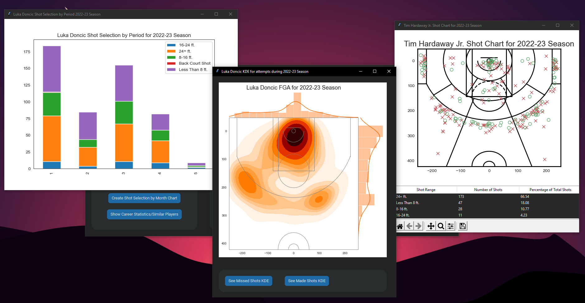

# nba_application 

nba_application is a tool used to visualize shot distribuitions for NBA players. I used nba_api to scrape data from [NBA.com](https://www.nba.com), nbashots to assist with visualizations, and CustomTkinter to create a UI.

The interface allows users to create:

- Visualizations for any season from 2016-17 through the current season.
- Heatmaps for FG%
- Bar Charts for shot selection by **quarter of the game** and **month**.
- Shot Charts/KDE plot for attempts , made shots, and missed shots
- Shot Charts also show a table breaking down attempts by distance from the basket into the bins ['Less Than 8 ft.' , '8-16 ft.' , '16-24 ft.' , '24+ ft.']*
- Career statistics tables

The tool also allows the user to find/compare similar players found through KMeans and quickly compare a player to their teammates.

## Career Statistics 
The career satistics button will prompt the tool to show:
- The career statistics table for the player selected
- The similar player comparison tool: This includes a drop down menu to choose from 10 of the most similar players, a season/year dropdown, and a button to quickly create a shot chart for the similar player/season selected.
- The teammate comparison tool: This includes a drop down menu to choose from teammates for the player, a season/year dropdown, and a button to quickly create a shot chart for the teammate/season selected.

### Similar Player/Teamate Comparison Tools

### Other Visualizations

## Reference/Requirements:
- nbashots: https://github.com/savvastj/nbashots 
- nba_api: https://github.com/swar/nba_api
- CustomTkinter: https://github.com/TomSchimansky/CustomTkinter
- Other requirements are in the requirements.txt file
- If 'remove_na' error occurs with seaborn. Refer to [this](https://stackoverflow.com/questions/60486125/i-am-facing-this-issue-in-seaborn-import) thread. 

> pip3 uninstall seaborn

> pip3 install seaborn

should solve this issue.

## NBA.com
NBA.com has a [Terms of Use](https://www.nba.com/termsofuse) regarding the use of the NBA’s digital platforms.
